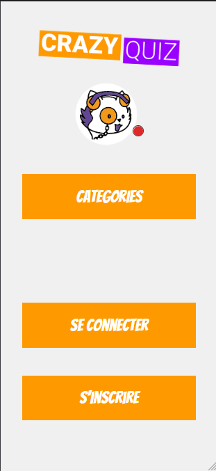

# Crazy Quiz.

<!-- Improved compatibility of back to top link: See: https://github.com/othneildrew/Best-README-Template/pull/73 -->

Afin de préparer ses élèves au passage de leur diplôme, l'école a décidé de mettre en place une application de quizz de culture générale afin que les étudiants puissent tester leurs connaissances de façon ludique.

Le quizz permet de tester plusieurs parties de leur parcours grace à un choix de catégorie qui sera alors au choix lorsque l'application sera lancée.

L'utilisateur peut accéder au quizz sans s'inscrire mais si il souhaite retrouver un historique de son score, il faudra alors qu'il soit connecté et donc enregistré.

 
  
  

## Nos objectifs: 

<ul>
<li>Création de la charte graphique</li>
<li>Établir la maquette</li>
<li>Développer le site web en épousant au mieux la maquette</li>
<li>Travailler en groupe en utilisant Github</li>
<li>Préparer la soutenance de ce projet</li>
</ul>

### Structure de notre application:

<ul>
<li>un écran d'accueil qui affichera le titre de l'application et la possibilité d'accéder au quizz</li>
<li>un écran qui permettra de choisir une catégorie</li>
<li>un écran, une fois la catégorie choisie, qui affiche la question, un timer de 20s et 4 possibilités de réponses</li>
<li>un écran qui affiche le résultat final</li>
<li>un écran pour visualiser/éditer le proil de l'utilisateur</li>
<li>un écran pour la connexion et l'inscription de l'utilisateur</li>
</ul>

### Resources utlisées: 

<ul>
<li>Framework React</li>
<li>React Icons pour les icones</li>
<li>LottiesFiles pour les animations</li>
<li>Figma pour la maquette et Wireframe</li>
<li>GoogleFonts pour les polices</li>
<li>Utilisation du Trello</li>
<li>Github pour travailler en groupe</li>
</ul>

### Langages Utilisés

* [![HTML5][html.com]][html-url]
* [![CSS3][css.com]][css-url]
* [![JS][js.com]][js-url]
* [![React][react.com]][react-url]

[html.com]: https://img.shields.io/badge/html5-%23E34F26.svg?style=for-the-badge&logo=html5&logoColor=white
[html-url]: https://html.com/
[css.com]: https://img.shields.io/badge/css3-%231572B6.svg?style=for-the-badge&logo=css3&logoColor=white
[css-url]: https://www.w3.org/Style/CSS/
[react.com]: https://img.shields.io/badge/React-20232A?style=for-the-badge&logo=react&logoColor=61DAFB
[react-url]: https://fr.reactjs.org/
[js.com]: https://img.shields.io/badge/JavaScript-323330?style=for-the-badge&logo=javascript&logoColor=F7DF1E
[js-url]: https://developer.mozilla.org/fr/docs/Web/JavaScript
[sass.com]: https://img.shields.io/badge/SASS-hotpink.svg?style=for-the-badge&logo=SASS&logoColor=white
[sass-url]: https://sass-lang.com/
